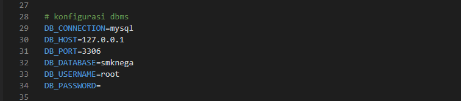
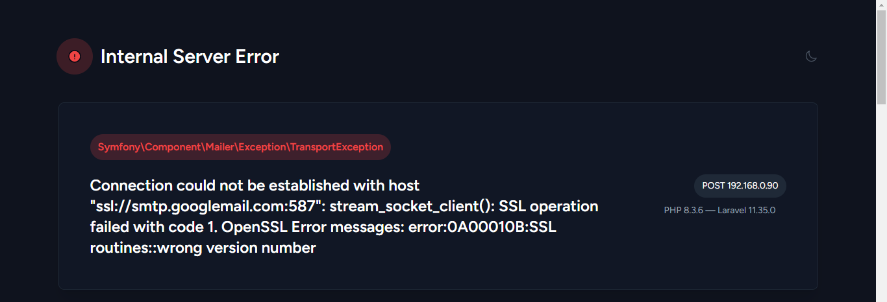

### step by step installation in web server ubuntu 24 (cara installasi di web server ubuntu)

## requirement / dibutuhkan

-   php8.3 php8.3-cli php8.3-mbstring php8.3-xml php8.3-bcmath php8.3-curl php8.3-zip php8.3-mysql
-   nginx unzip curl composer mysql-server nodejs npm git .

### can be used when the IP address configuration has been completed (requirement)
## installation / instalasi

###### For Superuser

-   **sudo su**
-   **apt update**

###### For Install PHP and Exstension Requirement

-   **apt install php8.3 php8.3-cli php8.3-mbstring php8.3-xml php8.3-bcmath php8.3-curl php8.3-zip php8.3-mysql unzip curl**

###### For Install Web Server

-   **apt install nginx**

###### For Install DBMS

-   **apt install mysql-server**

###### For Install Composer

-   **curl -sS https://getcomposer.org/installer | php**

###### For Move Composer

-   **mv composer.phar /usr/bin/composer**

###### For Get A Version Composer

-   **composer --version**

###### For Install Nvm

-   **curl -o- https://raw.githubusercontent.com/nvm-sh/nvm/v0.39.5/install.sh | bash**
-   **source ~/.bashrc** if error use **source ~/.zshrc**

###### For Install Nodejs Version 22
- **nvm install 22**

###### For Using Node Version 22
- **nvm use 22** 

###### For Get a Version Nodejs
- **node  --version**

###### For Installation NPM

-   **apt install npm**

###### For Get a Version NPM

-   **npm --version**

## configuration mysql

-   **mysql -u root -p**

###### For Create a New Database (name database optional)

-   **create database smknega**

###### For Create a New User

-   **create user "name_user"@"localhost" indentified by "pass_user"**

###### To Allow a User
- grant all privileges on * . * "name_user"@"localhost" 

- **exit**

###### For Restart Mysql
- **systemctl restart mysql** 

###### if you will try a new user , try logging into mysql with the newest user

## configurasi web

###### Go To the Directory Html

-   **cd /var/www/html**

###### For Clone a New Project

-   **git clone https://github.com/smkn1gedangan/smknega.git**
-   if git not installed yet , install git with command _apt install git_

###### For Change File Owner
- **chown www-data:www-data smknega** 

###### For Go To New Directory

-   **cd smknega**

## Make sure it's in the smknega folder

###### For Copy env.example To env
- **cp .env.example .env** 
- **nano .env**

-   must be the same
-   

-   match it with your mysql configuration
-   

-   must be the same
-   

## if config .env have been completed type the command below correctly in /var/www/html/smknega/

###### For Installing Dependency Composer
- **composer install** 

###### For New Key Website
- **php artisan key:generate** 

###### For Installing Node_module

-   **npm install**
-   **npm run build**

###### For Migrate All Table to Database Smknega (database name depends on config in the .env)
- **php artisan migrate:fresh --seed** 

###### For Access Permissions For a File
- **chmod -R 777 storage bootstrap/cache** 

###### For Clear All Cache / Routes / View (Require / Wajib Jika Konfigurasi Html sudah dijalankan semua)
- **php artisan optimize:clear** 

## configuration nginx

###### For Go To Nginx Config
- **nano /etc/nginx/sites-avaible/default**

###### make sure nginx have been enable 
- **systemctl enable nginx**

### please Also pay attention to semicolons and spaces (perhatikan titik koma dan spasi)
- 

###### Make sure there are no errors in the root directory and configuration code (pastikan tidak ada yang error untuk root directory dan konfigurasi lainnya)
- **nginx -t** 

- **systemctl restart nginx**
- **systemctl restart mysql**

- open in browser ip public web server
###### if the web server is successfully opened, open command below in url
- **https://ip or domain/login**

###### login with role admin
- **username : smknega@gmail.com**
- **password : admin**

###### If You Dont have an Account you can edited in database 

###### Later an email will come to smknega@gmail.com
###### Confirm

###### And All Configuration Finished , Good Luck

## Developers

##### error with command (systemctl restart nginx)

if config nginx have been finished and correctly but do not running , it usually happens because nginx conflicts with apache2 
- solution remove apache2 or nginx , depends on needs
because the web server command uses nginx , I recommend removing apache2 (karena perintah web server menggunakan nginx , saya rekomendasikan menghapus apache2)

- **sudo systemctl stop apache2**
- **sudo systemctl disable apache2**
- **sudo apt-get purge apache2 apache2-utils apache2-bin apache2.2-common**
- **sudo apt-get autoremove**
- **sudo rm -rf /etc/apache2**
- **apache2 -v**
- **systemctl restart nginx**

##### error with 
- 

if you encounter this error(jika anda menemukan error tersebut)
ubah 
- **MAIL_ENCRYPTION = ssl With port 465**
- **MAIL_ENCRYPTION = tls 587**

If that command not successfull , Double-check the command you ran earlier

